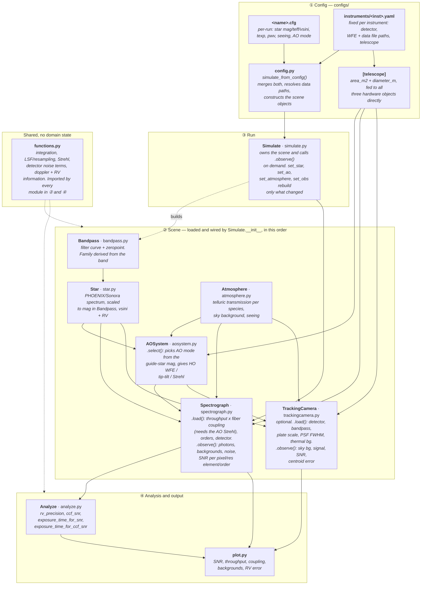

# specsim
Specsim is an SNR calculator developed for HISPEC/MODHIS, but it can be adapted to other instruments. It builds on a lot of functions from the PSISIM package. The main branch should be runnable after download - it does not include all the latest features and updates, but demonstrates the usage of the code.

## Installation
Clone the repo
```
> git clone https://github.com/ashbake/specsim.git
```
Move into that directory and run the following to pip install specsim and its dependencies:

**Depending on your python environment setup, this may not work. If not, install the packages listed in requirements.txt into your python 3 environment**

```
> pip install -e .
```

### Testing
A test suite lives in `tests/` and exercises the real PHOENIX/Sonora spectra and filter curves shipped in `data/` (e.g. checking that a model scaled to a given magnitude integrates back to that magnitude through yJHK bandpasses). Run it with:
```
> pip install pytest
> pytest
```

### Data Downloads & Setup
Many data files are needed to run the examples for MODHIS and HISPEC. A set of files are included in the repo in the data/ folder and are already linked to from the instrument YAML files, such that the only thing that needs to be done to run the example below is to unzip the telluric file provided.

Data is laid out by instrument, mirroring the paths in `configs/instruments/<instrument>.yaml`:
```
data/
  filters/                          # filter profiles + zeropoints.txt
  stel/phoenix/, stel/sonora/       # stellar model grids
  telluric/                         # PSG telluric spectrum + sky/ background
  track/                            # tracking camera transmission (shared)
  instrument/<hispec|modhis>/
    ao/                             # HO WFE + tip-tilt files, contrastcurves/
    track/                          # ZEMAX spot-size vs. field aberrations
    throughput/                     # per-subsystem throughput subfolders
                                    #   (feicam/ also holds the cold-snout
                                    #    blocking filter)
    order_bounds.csv
```

If you would like to download more files to run more stellar temperatures, magnitudes, and airmasses, read below. Otherwise skip to the *Running specsim* section at the bottom

#### AO Performance Files
AO files are needed to define the high order wavefront error and tip tilt residiuals as a function of the stellar magnitude. These WFE terms are used by the code to determine the fiber coupling performance. For HISPEC and MODHIS, we use AO simulations of the AO systems called HAKA and NFIRAOS, respectively, to generate the files provided in `data/instrument/<instrument>/ao/`, pointed to by `ho_wfe_file` and `tt_dynamic_file` under `ao:` in the instrument YAML.

The MODHIS dynamic tip tilt file, for example, called `TTDYNAMIC_NFIRAOS_091123.csv` contains columns of the magnitude, the flux (not sure what the flux is to, need to look into this) in that band in e-, and the tip tilt error in mas for the three main MODHIS AO modes: NGS, LGS_ON, and LGS_OFF. The header specifies that these magnitudes and flux values are defined in V band. In reality the MODHIS AO system receives a slightly more narrow range of wavelengths, so we should update this to some V_NFIRAOS label that specifies the specific wavelength range (this matters for red stars). Anywho, for now we can just use V band. 


#### Instrument (throughput) Files
The spectrograph reads three things under `spectrograph:` in the instrument YAML, each a path in its own right:

- `transmission_file` - a single two-column CSV (wavelength, fractional throughput) giving the **base** throughput: everything except fiber coupling. Wavelengths in nm, or in microns if the largest value is under 5. The bundled HISPEC file, `data/instrument/hispec/throughput/base_throughput.csv`, is spliced from the blue-arm (BSPEC) and red-arm (RSPEC) curves. The per-subsystem tree this was built from (ao, bspec, feiblue, feicam, feicom, feired, fibblue, fibred, rspec, tel, each holding a `{x}_throughput.csv`) is no longer bundled; the throughput-budget plotters in `specsim.plot` are the only thing that still reads it, and they take a `subsystems_path` pointing at a full HISPEC/MODHIS data checkout.
- `coupling_path` - the folder of fiber coupling simulation outputs, e.g. `couplingEff_atm1_adc1_PL0_defoc0nmRMS_LO0nmRMS_ttStatic1.5mas_ttDynamic5.5masRMS.csv`. The coupling depends on the wavefront error and also takes parameters specifying whether atmospheric refraction and ADC corrections were assumed, and if the photonic lantern (PL) was used. These are set under `spectrograph:` as `atm`, `adc`, and `pl_on`. Only part of the grid is bundled, so a run whose rounded tip/tilt lands on a missing file raises an error naming the combination it looked for.
- `inst_background_file` - a two-column CSV (wavelength, ph/s) of instrument thermal background, already including the throughput up to the spectrograph. This replaces the old per-subsystem emissivity calculation. Values are **per reduced pixel**, so the file bakes in the `res` and `pix_vert` it was generated with.

Total throughput is then base throughput x coupling x the AO dichroic.

In the future we will want the instrument files to include resolution as a function of wavelength. 

#### Tracking Camera Files
The file `HISPEC_ParaxialTel_OAP_TrackCamParax_SpotSizevsField.txt` lives in `data/instrument/<instrument>/track/` (pointed to by `aberrations_file` under `track:`) and is used to determine the off axis aberrations due to the tracking camera optics. This is only used in the tracking camera calculations to get the correct FWHM of the PSF as a function of field radius. This file is generated by Mitsuko using ZEMAX simulations for HISPEC and we can use it for MODHIS as well for now.

The tracking camera has its own transmission file variable (`transmission_file`) which is a static transmission profile unlike that of the spectrometer, which is split up. The tracking camera throughput file structure and units matches that of the individual instrument throughput files (microns, fractional transmission).

The cold-snout blocking filter used for the camera's thermal background is pointed to by `blocking_filter_file` under `track:`, and lives in each instrument's `track/` folder alongside the other tracking-camera files. Previously it was found implicitly by appending `feicam/blocking_filter.TXT` to the spectrograph's throughput path, which only HISPEC had -- so tracking-camera calculations failed for MODHIS. Both the blocking filter and the aberrations file are currently HISPEC-derived and copied into the MODHIS tree, so each instrument can be repointed independently as MODHIS-specific versions become available.

#### Filter Files
The filters used primarily here are 2MASS J/H/K and CFHT y band, similar to PSISIM. These are provided in the `data/filters/` folder (pointed to by `filter_path`/`zp_file` under `filt:` in the instrument YAML). Other filters can be used, but the code relies on the file `zeropoints.txt`, which contains zero point information for each filter. This file must be updated if a new filter is added. The filter band is specified under `[filt]` in the user `.cfg`; the filter family is derived from the band by `Bandpass.family_for_band` (2MASS for J/H/K, CFHT for y, Johnson otherwise), so you only set `band`. Set `family` explicitly under `[filt]` only for a band whose conventional family is not the one you want (e.g. the SLOAN, decam, or TESS curves in `data/filters/`). This filter profile is primarily used to correctly scale the magnitude of the stellar model. The band can also be changed at runtime with `sim.set_star(band='K')`. `specsim.available_bands(zp_file)` lists every `(family, band)` that can be loaded, and `Bandpass.loaded()` reports the ones loaded so far this session.

The [SVO service](http://svo2.cab.inta-csic.es/theory/fps/index.php?mode=browse&gname=2MASS&asttype=) is a handy place to download filter profiles.

#### Telluric File
The telluric models loaded by specsim are assumed to be in the format of PSG models, which should be high resolution and can be created using the psg wrapper called run_psg located [here](https://github.com/ashbake/run_psg). 

A spectrum is zipped and provided in `data/telluric/` that spans 800 to 2700nm. This file can be unzipped and linked to through the ```telluric_file``` variable under `atm:` in the instrument YAML.

#### Stellar Files

Phoenix Files: 

We recommend downloading specific Phoenix models [here](http://phoenix.astro.physik.uni-goettingen.de/?page_id=15), but if the full Phoenix HiRes Library is desired, it can be downloaded through FTP here: (ftp://phoenix.astro.physik.uni-goettingen.de/HiResFITS/). By default these come from `./data/stel/phoenix/`, set as ```phoenix_folder``` under ```stel:``` in the instrument YAML, so a user `.cfg` doesn't have to mention them. To use your own directory, give an **absolute** path -- either as ```phoenix_folder``` under ```[stel]``` in your `.cfg` (which overrides the YAML), or per run via `sim.set_star(phoenix_folder=...)` / `StarParams(phoenix_folder=...)`. A *relative* path in a `.cfg` resolves inside the specsim tree, not your working directory. PHOENIX models are used for teff >= 2300 K.


[Sonora](https://zenodo.org/record/1309035#.XbtLtpNKhMA) files: 

These default to `./data/stel/sonora/` via ```sonora_folder``` under ```stel:``` in the instrument YAML, and are overridden the same way as `phoenix_folder` above. Sonora models are used for teff < 2300 K.

### Contrast Files
For nonzero planet separations, specsim can calculate the expected contrast between star and planet using a database of radial profile files. These are specified by `contrast_profile_path` under `ao:` in the instrument YAML (e.g. `./data/instrument/modhis/ao/contrastcurves/`). In the case that these files are not installed, specsim will revert to using an analytical method of calculating the contrast based on input parameters. 


# Running specsim

First (from the code directory) start a python session and import some key packages from specsim:
```
> from specsim.config import simulate_from_config
> from specsim import plot
```

Configuration is split across two files. A user-facing `.cfg` file (e.g. `./configs/modhis_snr.cfg`) holds the parameters you'll typically change from run to run -- star magnitude/teff/vsini, exposure time, observing conditions (pwv/seeing), and which AO star to guide on -- plus `[run] instrument`, which selects an instrument. The parameters tied to that instrument (telescope area/diameter, detector properties, AO WFE file paths, tracking camera hardware, filter/telluric file paths) live in a corresponding YAML file under `configs/instruments/` (e.g. `configs/instruments/modhis.yaml`), so they don't need to be duplicated into every user config. `simulate_from_config` reads both and merges them into one `Simulate` scene:

```
> configfile = './configs/modhis_snr.cfg'      # user-facing config; its [run] section names the instrument
> sim = simulate_from_config(configfile)       # merges configs/instruments/modhis.yaml in automatically and builds the scene
```

### Running from your own folder

Writing a `.cfg` is all you need to do -- the instrument YAML is optional, and you can run from anywhere:

- **The instrument YAML is found for you.** specsim looks for `instruments/<instrument>.yaml` next to your own `.cfg` first, so a project can ship an override, and otherwise falls back to the copy bundled with specsim. Naming an instrument specsim doesn't have raises an error listing the ones it does.
- **Relative paths mean "inside the specsim tree", not "inside your working directory".** A `./data/...` path in either config file resolves against specsim's own source tree, so a `.cfg` kept anywhere on disk still finds specsim's filter curves, telluric spectra and WFE tables. To point at your own data instead, use an absolute path, or set an absolute `[run] data_folder` that the other relative paths resolve against.
- **Output still goes where you are.** Only input lookup is anchored; `savepath` and the like stay relative to your working directory.

So a minimal setup outside the repo is one file:

```
mkdir ~/my_project && cd ~/my_project
cp <specsim>/configs/modhis_snr.cfg ./my_run.cfg     # edit magnitudes, texp, conditions
python -c "from specsim import simulate_from_config; print(simulate_from_config('./my_run.cfg').snr())"
```

`sim` exposes the built domain objects as attributes (`sim.star`, `sim.spectrograph`, `sim.atmosphere`, `sim.ao_system`, `sim.filt`), and computes results on demand. Telescope area/diameter live on `sim.spectrograph` rather than a separate telescope object:
```
> observation = sim.snr()                                    # per-pixel/per-resolution-element/per-order SNR
> rv_result   = sim.rv_precision(telluric_cutoff=0.2, velocity_cutoff=2)
> ccf_result  = sim.ccf_snr()
> etc_result  = sim.exposure_time_for_snr(target_snr=100)
```

We can then use some plotting tools to plot the snr
```
> plot.plot_snr(sim.spectrograph, sim.ao_system, sim.filt, sim.star, snrtype='res_element', savepath=savepath)
```

`sim.snr()` returns the observed `Spectrograph` itself (the same object as `sim.spectrograph`) -- it carries both the hardware and the results, the same way `TrackingCamera` does. The instrument wavelength and flux per pixel in photons are in `.v` and `.s`; the per-resolution-element wavelength grid and SNR are in `.v_res_element` and `.snr_res_element`. Note `.ytransmit` is the total throughput on the model grid, while `.base_throughput_v` is the base throughput resampled onto `.v`.

To scan over a parameter without rebuilding the whole scene from scratch, use one of the four setters -- one per scene object, each taking any subset of that object's inputs -- then call `sim.snr()` again. See `examples/median_bin_snr.py`.

```python
sim.set_star(mag=12, teff=3500, vsini=5, rv=0)          # on-axis star
sim.set_star(mag=12, band='K')                           # ... and the band that mag is quoted in
sim.set_ao(mode='NGS', mag=14, mag_band='R', teff=4000)  # AO mode and guide star
sim.set_ao(ho_wfe=190, tt_dynamic=2.0)                   # ... or pin the WFE by hand
sim.set_atmosphere(pwv=1.5, seeing_set='good', zenith_angle=45)
sim.set_obs(texp=1800, nsamp=8)                          # exposure
```

Anything not passed is left unchanged, so `sim.set_star(mag=12)` moves only the magnitude; passing several at once does the reload work once rather than once per parameter. Each returns `sim`, so calls chain: `sim.set_obs(texp=1800).snr()`. `None` and `'default'` are real values, not "unchanged" -- `sim.set_ao(ho_wfe=None, tt_dynamic=None)` clears a WFE override, and `sim.set_ao(mag='default')` goes back to inheriting the science star's magnitude.

Changing `band` **reinterprets** the magnitude rather than colour-converting it: an H=10 star becomes a K=10 star, so its physical flux -- and the SNR -- change. Two knock-on effects, both correct rather than surprises to suppress: a companion's magnitude is quoted in the same band and is renormalised too, and `[ao] mag_band='default'` *means* "the science band", so an AO guide magnitude left at default follows along. Since `filt.center_wavelength` sets the Strehl, and the high-order and tip-tilt terms scale differently with wavelength, `mode='auto'` can legitimately pick a different AO mode after a band change. `sim.set_filter(band='K')` is an alias when you only want to move the band.


# Code structure

Data flows in one direction: **config files** are read into **scene objects**, the scene is exposed on the detectors, and everything downstream (**analysis**, **plots**) reads the result. Each detector owns both its hardware and its exposure, with the same two-phase shape: `.load()` sets up everything that depends only on the instrument and the AO correction, then `.observe()` exposes on a star. Telescope area and diameter are fed straight to `AOSystem`, `Spectrograph` and `TrackingCamera`, so no hardware object has to reach through another one for them. Each box below is one class or module; arrows are "is built from" / "feeds into".



The build order in the scene is not arbitrary: the star's magnitude sets which AO mode is chosen, the AO mode sets the wavefront error, and the wavefront error sets the fiber coupling that goes into the spectrograph throughput. This is what decides how much work each setter does. `set_star()` sits at the top of the chain, so it reloads the star, re-runs AO selection and reloads the coupling -- and `band` sits higher still, since it also renormalises any companion and moves the reference wavelength the Strehl is computed at, making it the most expensive input to change. `set_obs()` sits at the bottom and only marks the exposure stale, so the next `sim.snr()` re-runs `observe()`. `set_atmosphere()` splits: seeing and zenith angle index the AO WFE tables and so re-run the AO, while pwv only reaches the exposure and does not.

## Module reference

| Module | Holds | Notes |
| --- | --- | --- |
| `config.py` | `simulate_from_config()` | Only place that reads config files |
| `simulate.py` | `Simulate` | User-facing entry point; re-runs `observe()` only when an input changes |
| `bandpass.py` | `Bandpass`, `YJHK` | `load_filter`/`load_zp_table`/`get_zp` module-level; band→family convention on the class |
| `star.py` | `Star`, `StarParams` | `load_phoenix`/`load_sonora` module-level |
| `atmosphere.py` | `Atmosphere` | `load_telluric_transmission`/`load_sky_background` module-level |
| `aosystem.py` | `AOSystem` | AO mode choice -> WFE -> Strehl; `load_WFE` module-level |
| `spectrograph.py` | `Spectrograph` | Science detector: `.load()` throughput, then `.observe()` an exposure. Instrument throughput/coupling file readers live here |
| `trackingcamera.py` | `TrackingCamera` | Guide detector: `.load()` optics/PSF, then `.observe()` an exposure |
| `analyze.py` | `Analyze`, result dataclasses | Everything downstream of an exposure |
| `plot.py` | plotting functions | Takes domain objects, never a config |
| `functions.py` | generic math | No specsim imports — the bottom of the stack |


