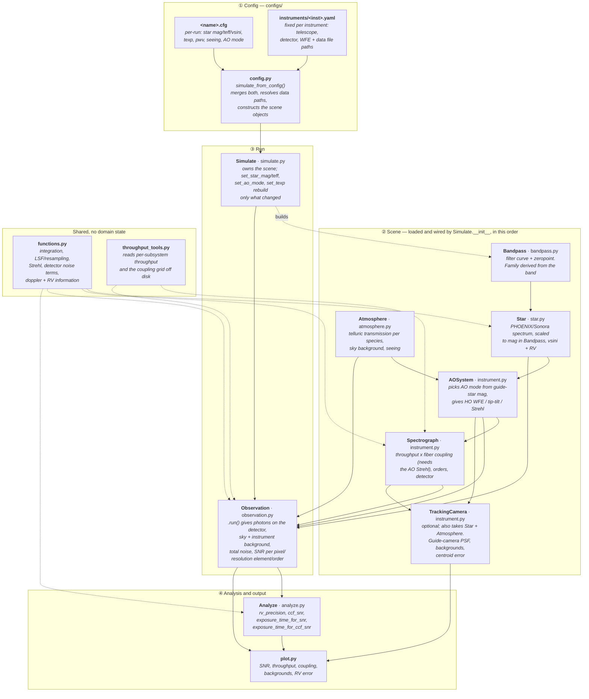

# specsim
Specsim is an SNR calculator developed for HISPEC/MODHIS, but it can be adapted to other instruments. It builds on a lot of functions from the PSISIM package. The main branch should be runnable after download - it does not include all the latest features and updates, but demonstrates the usage of the code.

## Installation
Clone the repo
```
> git clone https://github.com/ashbake/specsim.git
```
Move into that directory and run the following to pip install specsim and its dependencies:

**Depending on your python environment setup, this may not work. If not, install the packages listed in requirements.txt into your python 3 environment**

```
> pip install -e .
```

### Testing
A test suite lives in `tests/` and exercises the real PHOENIX/Sonora spectra and filter curves shipped in `data/` (e.g. checking that a model scaled to a given magnitude integrates back to that magnitude through yJHK bandpasses). Run it with:
```
> pip install pytest
> pytest
```

### Data Downloads & Setup
Many data files are needed to run the examples for MODHIS and HISPEC. A set of files are included in the repo in the data/ folder and are already linked to from the instrument YAML files, such that the only thing that needs to be done to run the example below is to unzip the telluric file provided.

Data is laid out by instrument, mirroring the paths in `configs/instruments/<instrument>.yaml`:
```
data/
  filters/                          # filter profiles + zeropoints.txt
  stel/phoenix/, stel/sonora/       # stellar model grids
  telluric/                         # PSG telluric spectrum + sky/ background
  track/                            # tracking camera transmission + ZEMAX aberrations
  instrument/<hispec|modhis>/
    ao/                             # HO WFE + tip-tilt files, contrastcurves/
    throughput/                     # per-subsystem throughput subfolders
    order_bounds.csv
```

If you would like to download more files to run more stellar temperatures, magnitudes, and airmasses, read below. Otherwise skip to the *Running specsim* section at the bottom

#### AO Performance Files
AO files are needed to define the high order wavefront error and tip tilt residiuals as a function of the stellar magnitude. These WFE terms are used by the code to determine the fiber coupling performance. For HISPEC and MODHIS, we use AO simulations of the AO systems called HAKA and NFIRAOS, respectively, to generate the files provided in `data/instrument/<instrument>/ao/`, pointed to by `ho_wfe_file` and `tt_dynamic_file` under `ao:` in the instrument YAML.

The MODHIS dynamic tip tilt file, for example, called `TTDYNAMIC_NFIRAOS_091123.csv` contains columns of the magnitude, the flux (not sure what the flux is to, need to look into this) in that band in e-, and the tip tilt error in mas for the three main MODHIS AO modes: NGS, LGS_ON, and LGS_OFF. The header specifies that these magnitudes and flux values are defined in V band. In reality the MODHIS AO system receives a slightly more narrow range of wavelengths, so we should update this to some V_NFIRAOS label that specifies the specific wavelength range (this matters for red stars). Anywho, for now we can just use V band. 


#### Instrument (throughput) Files
Instrument throughput files follow a particular format that is currently hard coded to reflect the file structure from code developed for HISPEC/MODHIS. Luckily there is the option to bypass this by populating the `transmission_file` variable under `spectrograph:` in the instrument YAML. If this is filled with a filename that is not None, it will load the contents of that file as the total throughput.

Otherwise the code requires `transmission_path` to point to the folder that contains the subfolders named the following: ao, bspec, coupling, feiblue, feicam, feicom, feired,fibblue,fibred, rspec, and tel. All but the coupling/ folder should contain a file called '{x}_throughput.csv' where {x} is the folder name, e.g. ao/ should contain the file ao_throughput.csv. The file header is wavelength_um, throughput - the first column is the wavelength in microns and the second column is the fractional throughput.

The coupling folder should contain the output to fiber coupling simulations e.g. `couplingEff_atm1_adc1_PL0_defoc0nmRMS_LO0nmRMS_ttStatic1.5mas_ttDynamic5.5masRMS.csv`. The coupling depends on the wavefront error and also takes parameters specifying where atmospheric refraction and ADC corrections were assumed, and if the photonic lantern (PL) was used. These parameters are defined under `spectrograph:` in the instrument YAML as `adc`, `atm`, and `pl_on`, respectively.

In the future we will want the instrument files to include resolution as a function of wavelength. 

#### Tracking Camera Files
The file `HISPEC_ParaxialTel_OAP_TrackCamParax_SpotSizevsField.txt` lives in `data/track/` (pointed to by `aberrations_file` under `track:`) and is used to determine the off axis aberrations due to the tracking camera optics. This is only used in the tracking camera calculations to get the correct FWHM of the PSF as a function of field radius. This file is generated by Mitsuko using ZEMAX simulations for HISPEC and we can use it for MODHIS as well for now.

The tracking camera has its own transmission file variable (`transmission_file`) which is a static transmission profile unlike that of the spectrometer, which is split up. The tracking camera throughput file structure and units matches that of the individual instrument throughput files (microns, fractional transmission).

#### Filter Files
The filters used primarily here are 2MASS J/H/K and CFHT y band, similar to PSISIM. These are provided in the `data/filters/` folder (pointed to by `filter_path`/`zp_file` under `filt:` in the instrument YAML). Other filters can be used, but the code relies on the file `zeropoints.txt`, which contains zero point information for each filter. This file must be updated if a new filter is added. The filter band is specified under `[filt]` in the user `.cfg`; the filter family is derived from the band by `Bandpass.family_for_band` (2MASS for J/H/K, CFHT for y, Johnson otherwise), so you only set `band`. Set `family` explicitly under `[filt]` only for a band whose conventional family is not the one you want (e.g. the SLOAN, decam, or TESS curves in `data/filters/`). This filter profile is primarily used to correctly scale the magnitude of the stellar model.

The [SVO service](http://svo2.cab.inta-csic.es/theory/fps/index.php?mode=browse&gname=2MASS&asttype=) is a handy place to download filter profiles.

#### Telluric File
The telluric models loaded by specsim are assumed to be in the format of PSG models, which should be high resolution and can be created using the psg wrapper called run_psg located [here](https://github.com/ashbake/run_psg). 

A spectrum is zipped and provided in `data/telluric/` that spans 800 to 2700nm. This file can be unzipped and linked to through the ```telluric_file``` variable under `atm:` in the instrument YAML.

#### Stellar Files

Phoenix Files: 

We recommend downloading specific Phoenix models [here](http://phoenix.astro.physik.uni-goettingen.de/?page_id=15), but if the full Phoenix HiRes Library is desired, it can be downloaded through FTP here: (ftp://phoenix.astro.physik.uni-goettingen.de/HiResFITS/). These go in any directory, specified as ```phoenix_folder``` under ```[stel]``` in the user `.cfg` (default `./data/stel/phoenix/`). PHOENIX models are used for teff >= 2300 K.


[Sonora](https://zenodo.org/record/1309035#.XbtLtpNKhMA) files: 

These should be unzipped into any directory, which should be specified as the variable ```sonora_folder``` under ```[stel]``` in the user `.cfg` (default `./data/stel/sonora/`). Sonora models are used for teff < 2300 K.

### Contrast Files
For nonzero planet separations, specsim can calculate the expected contrast between star and planet using a database of radial profile files. These are specified by `contrast_profile_path` under `ao:` in the instrument YAML (e.g. `./data/instrument/modhis/ao/contrastcurves/`). In the case that these files are not installed, specsim will revert to using an analytical method of calculating the contrast based on input parameters. 


# Running specsim

First (from the code directory) start a python session and import some key packages from specsim:
```
> from specsim.config import simulate_from_config
> from specsim import plot
```

Configuration is split across two files. A user-facing `.cfg` file (e.g. `./configs/modhis_snr.cfg`) holds the parameters you'll typically change from run to run -- star magnitude/teff/vsini, exposure time, observing conditions (pwv/seeing), and which AO star to guide on -- plus `[run] instrument`, which selects an instrument. The parameters tied to that instrument (telescope area/diameter, detector properties, AO WFE file paths, tracking camera hardware, filter/telluric file paths) live in a corresponding YAML file under `configs/instruments/` (e.g. `configs/instruments/modhis.yaml`), so they don't need to be duplicated into every user config. `simulate_from_config` reads both and merges them into one `Simulate` scene:

```
> configfile = './configs/modhis_snr.cfg'      # user-facing config; its [run] section names the instrument
> sim = simulate_from_config(configfile)       # merges configs/instruments/modhis.yaml in automatically and builds the scene
```

`sim` exposes the built domain objects as attributes (`sim.star`, `sim.spectrograph`, `sim.atmosphere`, `sim.ao_system`, `sim.filt`), and computes results on demand. Telescope area/diameter live on `sim.spectrograph` rather than a separate telescope object:
```
> observation = sim.snr()                                    # per-pixel/per-resolution-element/per-order SNR
> rv_result   = sim.rv_precision(telluric_cutoff=0.2, velocity_cutoff=2)
> ccf_result  = sim.ccf_snr()
> etc_result  = sim.exposure_time_for_snr(target_snr=100)
```

We can then use some plotting tools to plot the snr
```
> plot.plot_snr(observation, sim.ao_system, sim.filt, sim.star, sim.spectrograph, snrtype='res_element', savepath=savepath)
```

The instrument wavelength and instrument flux per pixel in units of photons are stored in `observation.v` and `observation.s`, respectively. The per resolution element wavelength grid and SNR are in `observation.v_res_element` and `observation.snr_res_element`.

To scan over a parameter (e.g. magnitude) without rebuilding the whole scene from scratch, use `sim.set_star_mag(mag)` / `sim.set_ao_mode(mode)` / `sim.set_texp(texp)`, then call `sim.snr()` again -- see `examples/median_bin_snr.py`.


# Code structure

Data flows in one direction: **config files** are read into **scene objects**, the scene is combined into a single **Observation**, and everything downstream (**analysis**, **plots**) reads that Observation. Each box below is one class or module; arrows are "is built from" / "feeds into".



The build order in the scene is not arbitrary: the star's magnitude sets which AO mode is chosen, the AO mode sets the wavefront error, and the wavefront error sets the fiber coupling that goes into the spectrograph throughput. That is why `set_star_mag()` and `set_star_teff()` re-run the AO selection and reload the coupling, while `set_texp()` only invalidates the cached Observation.

## Module reference

| Module | Holds | Notes |
| --- | --- | --- |
| `config.py` | `simulate_from_config()` | Only place that reads config files |
| `simulate.py` | `Simulate` | User-facing entry point; caches the Observation |
| `bandpass.py` | `Bandpass`, `YJHK` | Filter loading, zeropoints, band→family convention |
| `star.py` | `Star`, `StarParams` | `load_phoenix`/`load_sonora` module-level |
| `atmosphere.py` | `Atmosphere` | `load_telluric_transmission`/`load_sky_background` module-level |
| `instrument.py` | `AOSystem`, `Spectrograph`, `TrackingCamera` | Hardware; the three reference each other |
| `observation.py` | `Observation` | Signal + background + noise for one exposure |
| `analyze.py` | `Analyze`, result dataclasses | Everything downstream of an Observation |
| `plot.py` | plotting functions | Takes domain objects, never a config |
| `functions.py` | generic math | No specsim imports — the bottom of the stack |
| `throughput_tools.py` | throughput/coupling file readers | Instrument-file format lives here |


